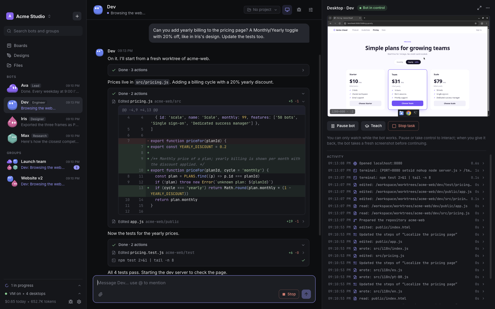
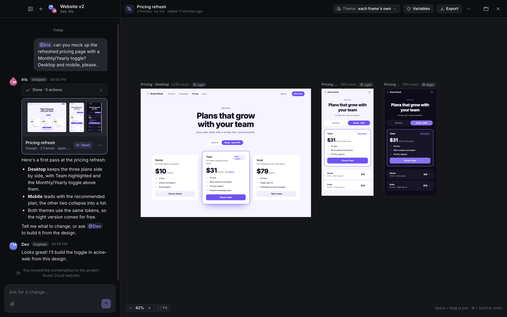
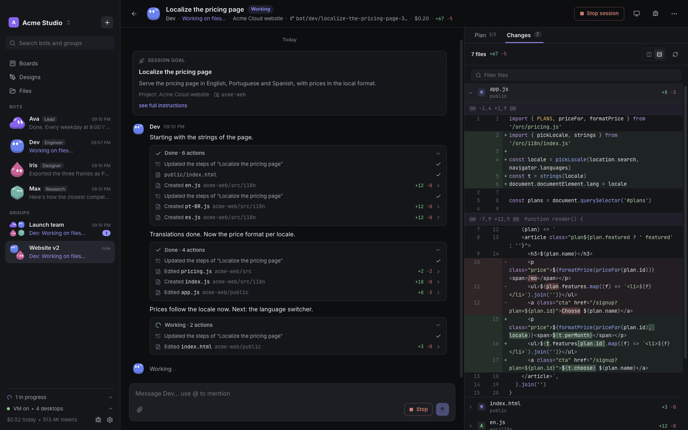
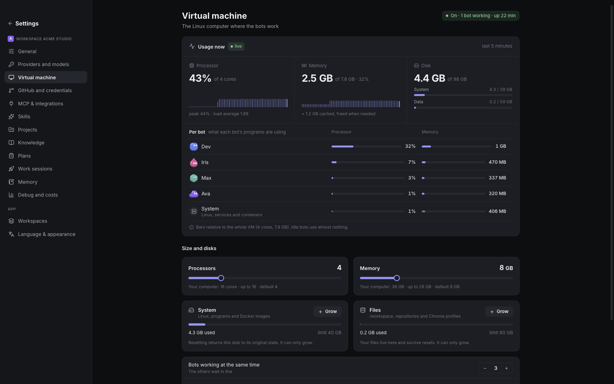

<p align="center">
  
</p>

<h1 align="center">Milibot</h1>

<p align="center"><strong>A team of AI agents that work for you on their own computer.</strong></p>

<p align="center">
  
</p>

Milibot is a desktop app where you chat with a small team of bots, and each bot has a real Linux desktop to work on. Bots browse the web, write and run code, open pull requests, read your documents, run scheduled routines and talk to each other, while you watch their screens live and step in at any time.

Everything runs on your computer: a background service manages one Debian virtual machine per workspace (QEMU), and the bots reach models through your own providers (a Claude Code or Codex subscription, the Anthropic API, OpenRouter or any OpenAI-compatible server).

> **Status:** early development (v0.1). Builds for macOS (Apple Silicon), Linux (x64, arm64) and Windows (x64); macOS is the most tested.

<table>
  <tr>
    <td width="33%" valign="top"><a href=".github/screenshots/design.png"></a><br><sub><b>Canvas.</b> A designer bot drafts screens with themes and variables.</sub></td>
    <td width="33%" valign="top"><a href=".github/screenshots/session.png"></a><br><sub><b>Work sessions.</b> An approved plan runs in parallel, with live steps and a diff viewer.</sub></td>
    <td width="33%" valign="top"><a href=".github/screenshots/vm.png"></a><br><sub><b>One VM per workspace.</b> Live processor and memory use per bot.</sub></td>
  </tr>
</table>

## Features

**A team, not a single chatbot**

- **Bots with roles.** Specialists with their own prompt, model, avatar and memory. A bot can refine its own role description as you correct it, with versioned history and undo, or with your approval first.
- **Direct messages and groups.** In a group, @mention a bot or let a cheap triage model pick who answers. Loop guards keep bots from talking to each other forever.
- **Bots delegate to bots** in private threads you can read, and you always see what each one is doing. Pause, stop or take over its screen.
- **Keeps working in the background.** The daemon runs after you close the window and can start at login.

**A real computer for every bot**

- **One Debian 13 VM per workspace**, with an XFCE desktop per bot, a shared `/workspace` folder, and git, Docker, Python, Node, Go and Rust preinstalled.
- **Watch and take over.** Each bot's screen streams over VNC inside the app.
- **Text-first browser tools.** Bots read pages as a compact accessibility snapshot of the same Chrome you see on their desktop, and use screenshots only when they need them.
- **Teach by demonstration.** Do a task on a bot's screen once; Milibot writes a step-by-step procedure the bot follows later.

**Real work**

- **Code.** A git worktree and branch per bot; file edits show up as diffs in the chat, and pull requests as live cards.
- **Plans and work sessions.** For bigger jobs a bot writes a plan and waits for your approval, then runs it in a separate lane with live steps, a diff viewer and optional helper sub-agents.
- **Routines** in plain language ("every weekday at 9am") or cron, including while the app is closed.
- **Projects** group conversations, notes and documents by line of work.

**Memory and knowledge**

- **Long conversations that never reset.** Old messages are summarized in the background and stay searchable; the context is laid out for prompt caching.
- **Knowledge base.** PDFs, Office files, EPUB, images (OCR) and spreadsheets, extracted inside the VM and indexed with hybrid search (full text plus vectors). Embeddings run locally or through a provider.

**Skills and designs**

- **Skills.** `SKILL.md` folders that bots load on demand: built-ins for code, the browser, plans, routines, designs, slides and documents; import more from a folder, a zip or GitHub, or let bots write their own.
- **Canvas.** Bots design screens, slides and documents as HTML with named themes and variables; export frames as PNG, PDF or HTML for a coding bot to implement.

**Your data and keys stay yours**

- **Secrets never reach the model.** Keys live in the system keychain; bots use secrets by reference and values are redacted from logs, tool results and chat.
- **External tools through MCP**, inside the VM (stdio) or remote (HTTP with OAuth), on or off per bot.
- **Costs under control.** Every model call is logged with tokens, cache hits and cost; daily spend limits can warn or pause the team.
- **Backups.** Export a workspace and import it as a new one.

## Requirements

- macOS on Apple Silicon, Linux x64/arm64 (with KVM) or Windows x64 (with the Windows Hypervisor Platform)
- Enough memory for a VM (the smallest preset uses about 4 GB; the recommended one about 8 GB)
- For development: Node.js 24 and pnpm (through corepack)

## Getting started (development)

```bash
corepack enable
pnpm install
pnpm dev            # daemon (tsx watch) + Electron app
```

On first launch, the setup asks for a model provider and the VM size, builds the Debian base image the first time (a few minutes, needs internet access) and optionally signs in to Claude Code or Codex inside the VM.

To keep development data off your real profile:

```bash
MILIBOT_DATA_DIR=/path/to/devdata MILIBOT_SECRET_STORE=memory pnpm dev
```

| Variable                         | Effect                                                                                                                                                                    |
| -------------------------------- | ------------------------------------------------------------------------------------------------------------------------------------------------------------------------- |
| `MILIBOT_DATA_DIR`               | Where workspaces, VM disks and logs live. Default: `~/Library/Application Support/Milibot` (macOS), `$XDG_DATA_HOME/milibot` (Linux), `%LOCALAPPDATA%\Milibot` (Windows). |
| `MILIBOT_SECRET_STORE=memory`    | Keep secrets in memory instead of the system keychain.                                                                                                                    |
| `MILIBOT_VM_AUTOSTART=0`         | Do not boot a workspace's VM when it is opened.                                                                                                                           |
| `MILIBOT_FAKE_LLM=<script.json>` | Replace every model with a scripted fake, for demos and tests.                                                                                                            |
| `MILIBOT_FAKE_EMBEDDINGS=1`      | Deterministic embeddings, with no model download.                                                                                                                         |

### Tests

```bash
pnpm check          # typecheck, lint, format check, unit and integration tests
```

Unit tests use in-memory SQLite. Integration tests run real databases and runtime processes in temp dirs, with a fake VM and a fake model: no API keys and no VM needed. The browser tests run a local headless Chrome against fixture pages and are skipped if Chrome is not installed.

### Packaging

```bash
pnpm package       # installer for the current OS
pnpm package:dir   # unpacked app only
```

Outputs a `.dmg` on macOS, an `.AppImage` and a `.deb` on Linux, and an NSIS installer on Windows. Build on the target OS and architecture; the app bundles its own Node 24 runtime for the daemon. Unsigned macOS builds are signed ad hoc; set the usual `CSC_*`/`WIN_CSC_*`/`APPLE_*` variables to sign and notarize. CI runs on every pull request and push to `main`; releases are cut by hand from the Release workflow (semantic-release: the version and `CHANGELOG.md` come from the Conventional Commits, installers go to a draft GitHub release).

## Project layout

| Path              | What it is                                                                                                                                                                                       |
| ----------------- | ------------------------------------------------------------------------------------------------------------------------------------------------------------------------------------------------ |
| `apps/daemon`     | The daemon. A supervisor (Fastify + WebSocket, token-protected, loopback only) spawns one runtime process per workspace, which owns that workspace's SQLite database, the VM and the agent host. |
| `apps/desktop`    | The Electron app: main process, sandboxed preload, React renderer.                                                                                                                               |
| `packages/shared` | Zod schemas, the typed HTTP API and WebSocket event definitions shared by the daemon and the app.                                                                                                |
| `packages/agent`  | Agent host (turns, lanes, context and memory), model providers, the Claude Code and Codex engines, tool definitions, prompts and built-in skills.                                                |
| `vm/host`         | Command-line tools that build the golden image and run each workspace's VM (QEMU).                                                                                                               |
| `vm/guest-agent`  | The agent that runs inside the VM; `vm/` also holds the provisioning scripts.                                                                                                                    |

## Contributing

Issues and pull requests are welcome: see [CONTRIBUTING.md](CONTRIBUTING.md). Please report security problems privately ([SECURITY.md](SECURITY.md)).

## License

Milibot is **source-available** under the [PolyForm Shield License 1.0.0](LICENSE.md):

- **Allowed:** anyone, including companies, can download, use, study and modify Milibot for any purpose, at home or at work.
- **Not allowed:** using it to offer a competing product, such as reselling it, rebranding it or building a hosted service on top of it.
- **Name and branding:** "Milibot", its name, logo and bot avatars are not licensed. Modified versions must use a different name and must credit the original. See [NOTICE](NOTICE).

Because of these limits, this is not an OSI-approved open-source license.
